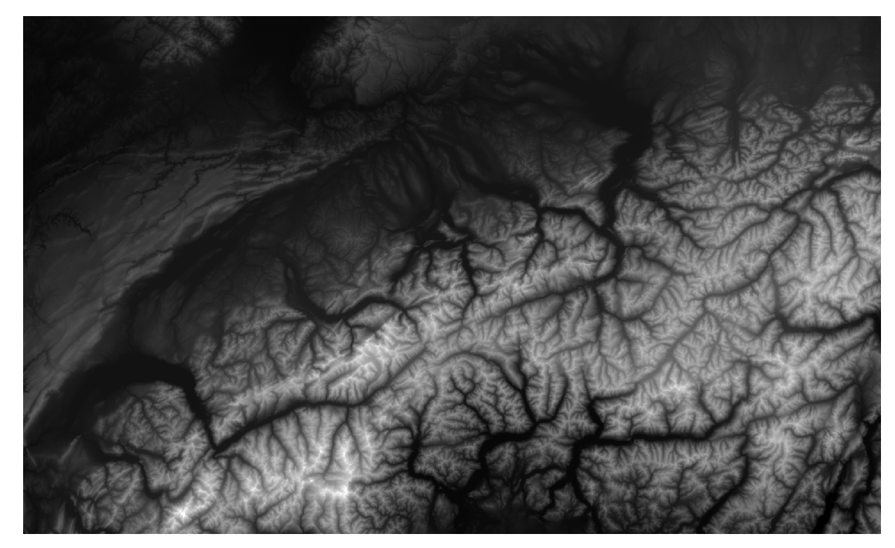

# mapterhorn-gdal
Mapterhorn XML file for direct use in GDAL

GDAL does not natively understand the Terrarium elevation encoding used by Mapterhorn. This repository contains a python server to turn the Mapterhorn Terrarium elevation tiles into float32 GeoTIFFs. An XML file then allows to use a local z/x/y.tif endpoint as input for GDAL.

## Requirements

Install UV: https://docs.astral.sh/uv/getting-started/installation/

## Steps

Start the server with:

```
uv run uvicorn terrain_server:app --host 0.0.0.0 --port 8000
```

Your server should now be up an running. You can try downloading the 0/0/0.tif tile at 

http://localhost:8000/0/0/0.tif

Next, you can open `mapterhorn-terrain.xml` with any software that can read what GDAL can read. Example:

```
gdalwarp \
  -of GTiff \
  -te_srs EPSG:4326 \
  -te 5.875 45.7469 11.1759 47.937 \
  -tr 300 300 \
  -r bilinear \
  mapterhorn-terrain.xml output.tif
```

Which should create this `output.tif` file:



